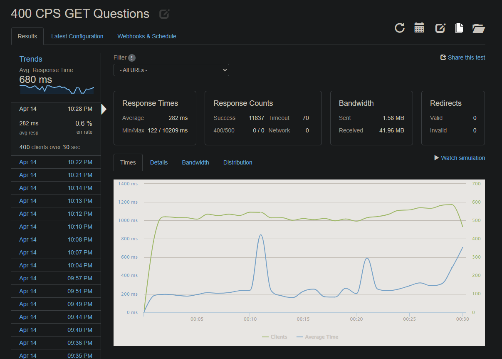

# BluegillAPI

## Table of Contents

- [Description](#Description)
- [Technologies Used](#Technologies-Used)
- [Installation and Setup](#Installation-and-Setup)
- [Sample .env File](#Sample-.env-File)
- [Approach and Implementation](#approach-and-implementation)
- [Test Analysis & Results](#test-analysis-and-results)

## Description

BluegillAPI is a RESTful API that allows for the fast and secure access of data stored for an e-commerce application. It was created to replace a legacy API service. The API supports endpoints for the "Questions and Answers" segment of the product page.

## Technologies Used


## Installation and Setup

To install and run:

1. Clone the repository
2. Run `npm install`
3. Create a .env file with the necessary environment variables (see [Sample .env File](#Sample-.env-File) for an example)
4. Run `npm run start` to start the server

## Sample .env File

```
DB_HOST="localhost"
DB_USER="postgres"
DB_PASSWORD="password"
DB_NAME="bluegill"
```

## Approach and Implementation

## Results and Takeaways

Top Performance Achieved

- Response Time (latency) - 282ms
- Throughput - 394.5rps
- ERR - 0.6%


