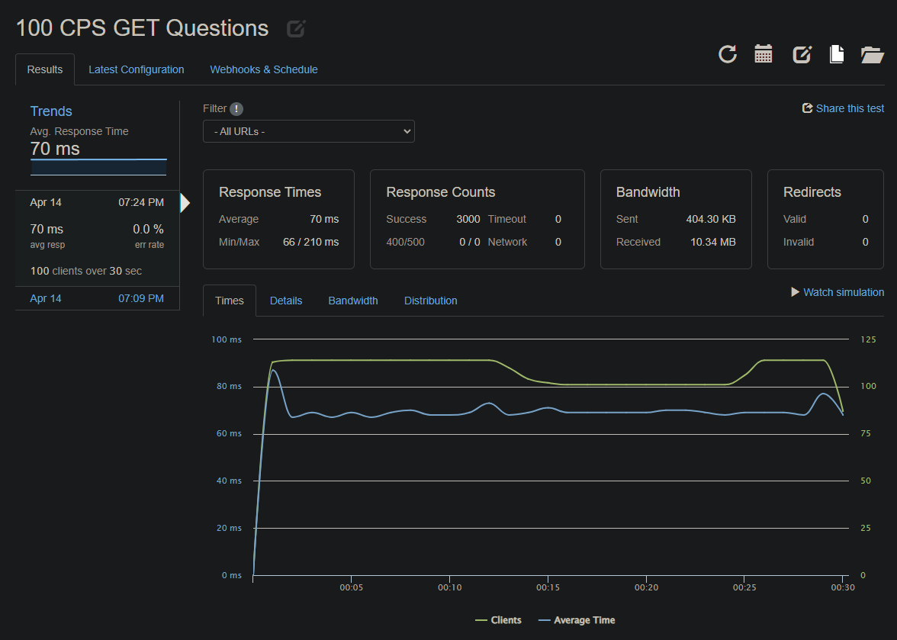
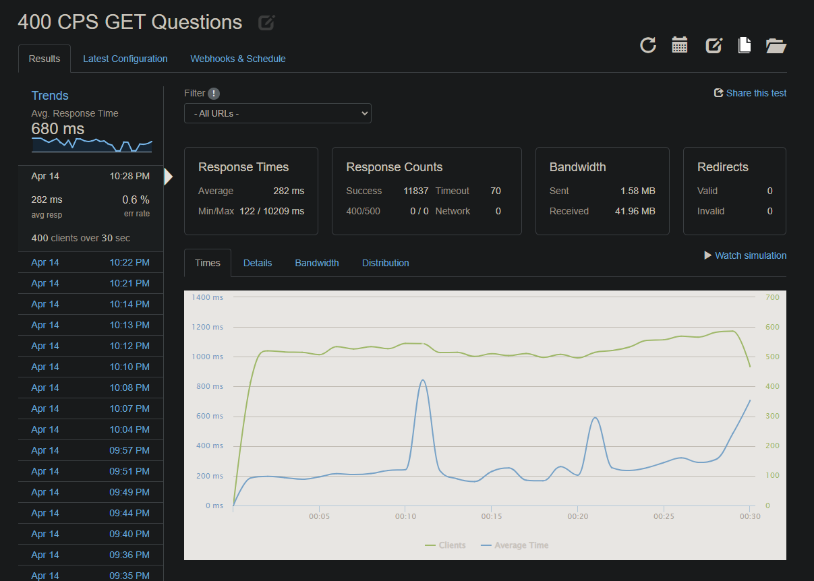

# BlueGillAPI

## Table of Contents

- [Description](#Description)
- [Technologies Used](#Technologies-Used)
- [Installation and Setup](#Installation-and-Setup)
- [Sample .env File](#Sample-.env-File)

## Description

BlueGillAPI is a RESTful API that allows for the fast and secure access of data stored in the Black Clover e-commerce application.It was created to allow for the fast and secure access of data stored and is used to power the 'Question and Answers' segment of the Black Clover e-commerce website.

## Technologies Used


[Amazon AWS](https://aws.amazon.com/)
[PostgreSQL](https://www.postgresql.org/)

[Node.js](https://nodejs.org/)

## Installation and Setup

To install and run the project:

1. Clone the repository
2. Run `npm install`
3. Create a .env file with the necessary environment variables (see [Sample .env File](#Sample-.env-File) for an example)
4. Run `npm run start` to start the server

## Sample .env File

```
DB_HOST="localhost"
DB_USER="postgres"
DB_PASSWORD="password"
DB_NAME="bluegill"
```

## Test Analysis and Results

### GOAL - Review Benchmark takeaways, research and prescribe potential solution, and measure results

ANALYSIS - High CPU usage is an indicative cause for reduced backend RPS performance. Scaling infrastructure to match needs is a viable solution to realign performance with target metrics.
To maintain cost-effectiveness, horizontal scaling will be explored before vertical scaling. Will additionally add redundancy to service.

Baseline Requirement Met


Top Performance Achieved

- Response Time (latency) - 282ms
- Throughput - 394.5rps
- ERR - 0.6%


